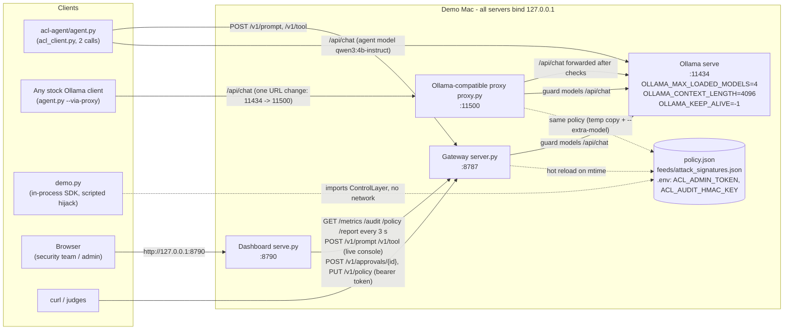
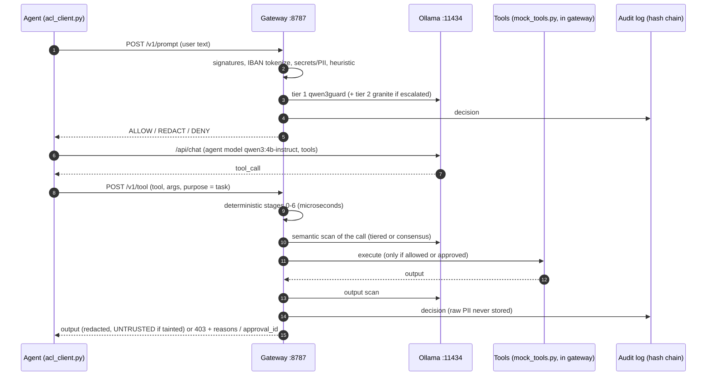
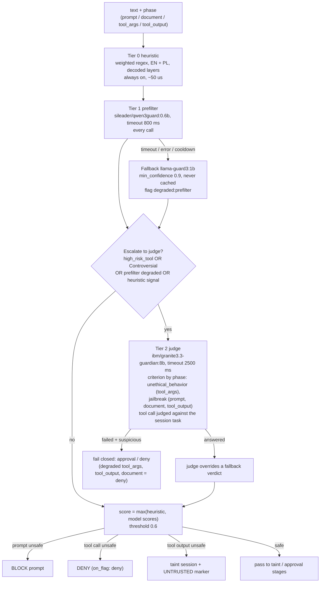
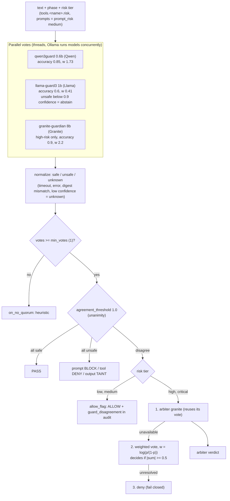
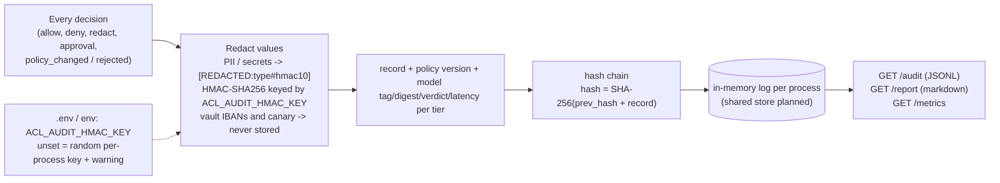
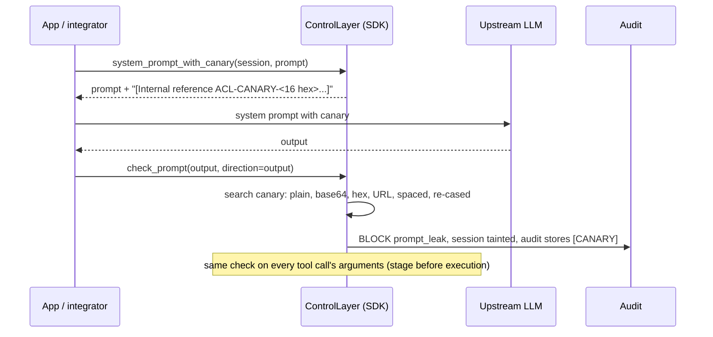
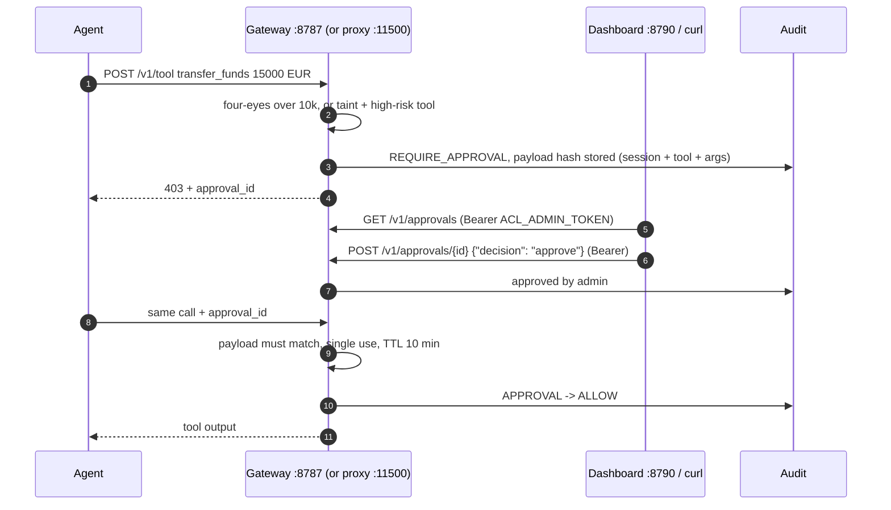
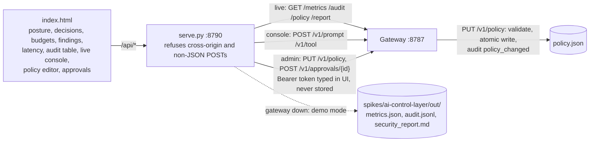
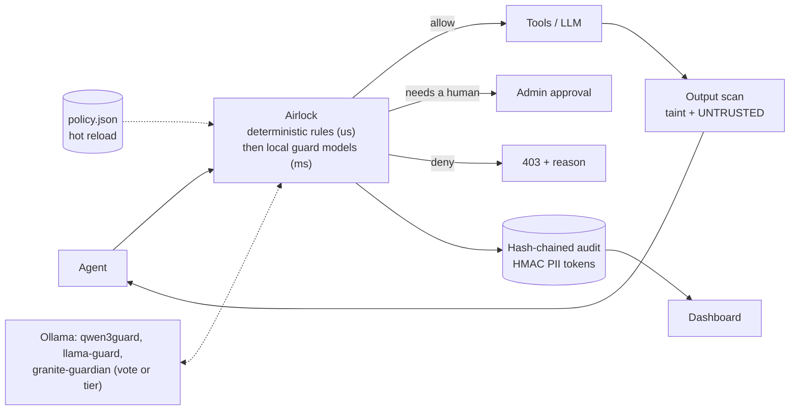

# Airlock (AI Control Layer) - network and architecture schemas

For the pitch deck, video and Andrzej's 3D view. Derived from the code on main (`19d3635`): `spikes/ai-control-layer/` (`server.py`, `control_layer.py`, `semantic.py`, `policy.json`), `spikes/acl-ollama-proxy/`, `spikes/acl-agent/`, `spikes/acl-dashboard/`, plus `docs/architecture/README.md` and `docs/research/demo-mac-test.md`. Anything uncertain is marked **?**. Nothing here is new design; the pipeline stage list in `docs/architecture/README.md` section 1 stays the reference.

## 1. Network map (demo Mac, everything on 127.0.0.1)



Ports and processes (from the READMEs and `demo-mac-test.md`):

| Process | Port | Started with | Talks to |
|---|---|---|---|
| Ollama | 11434 | `OLLAMA_MAX_LOADED_MODELS=4 OLLAMA_CONTEXT_LENGTH=4096 OLLAMA_KEEP_ALIVE=-1 ollama serve` | - (4 models resident, about 12.8 GB) |
| Gateway | 8787 | `python3 spikes/ai-control-layer/server.py` | Ollama 11434 (guards) |
| Proxy | 11500 | `python3 spikes/acl-ollama-proxy/proxy.py --extra-model qwen3:4b-instruct-2507-q4_K_M@0edcdef34593` | Ollama 11434 (agent model + guards) |
| Dashboard | 8790 | `python3 spikes/acl-dashboard/serve.py` | Gateway 8787, else last `demo.py` run in `out/` |
| Agent | - | `python3 spikes/acl-agent/agent.py [--via-proxy] --scenario ...` | Gateway 8787 + Ollama 11434, or proxy 11500 |

Private test Ollama instances on :11435 / :11436 were used only for measurements and are not part of the demo setup.

Models on Ollama (`policy.json` `models.roles`, digests pinned):

| Model | Role | Digest |
|---|---|---|
| `qwen3:4b-instruct-2507-q4_K_M` | agent (the upstream LLM in the demo) | `0edcdef34593` |
| `sileader/qwen3guard:0.6b` | guard: tier 1 prefilter, consensus voter | `6e7ffdf64920` |
| `llama-guard3:1b` | guard: prefilter fallback, consensus voter | `494147e06bf9` |
| `ibm/granite3.3-guardian:8b` | guard: tier 2 judge, consensus high-risk voter, arbiter | `90a8aabc98eb` |

## 2. Request flow: client -> gateway -> tiers -> upstream LLM

There are two integration paths. The "upstream LLM" is the local agent model on Ollama; no remote LLM in the committed policy (local-only).

### 2a. SDK / HTTP gateway path (acl-agent)

The agent calls the model itself and asks the gateway before and after. Tools execute inside the gateway (`mock_tools.py`).



### 2b. Ollama-compatible proxy path (no SDK)

```mermaid
sequenceDiagram
    autonumber
    participant C as Stock Ollama client
    participant P as Proxy :11500
    participant O as Ollama :11434

    C->>P: POST /api/chat (X-ACL-Session)
    P->>P: model allowlist + digest pin + budget
    P->>P: new user msgs: prompt check; new tool msgs: redact + injection check (taint, UNTRUSTED marker)
    P->>O: forward /api/chat (non-streaming)
    O-->>P: reply with tool_calls
    P->>P: full tool check per tool_call (before the client sees it)
    P->>P: output check on text, token + compute budget update
    P-->>C: reply; DENY / REQUIRE_APPROVAL tool_calls stripped, note in content, decisions under "acl"
    Note over P: /api/tags, /api/version pass through. Every other endpoint = 403 (fail closed)
```

## 3. Tiered semantic scan (default, `controls.semantic.mode: "tiered"`)

Runs after the deterministic stages, on prompts, documents, tool args and tool outputs (`semantic.py`).



High-risk tools (judge always runs): `transfer_funds`, `send_email`, `delete_records`, `run_python`, `load_model`.

## 4. Consensus mode ("Rój" inside Airlock, option A **?**: guards voting)

`controls.semantic.mode: "consensus"` (default stays `tiered`; `demo.py --consensus`). The "option A" label is from the coordinator's brief; the repo calls it guard consensus mode (commits `0952c83`, `2fcd99a`).



Human approval in consensus mode only when a tier is explicitly set to `require_approval`; never by default. Every phase records votes, weights, digests, latency and the resolution; `/metrics.guard_consensus` counts disagreements and how they were resolved.

## 5. Audit log and HMAC PII tokens



Same PESEL / IBAN / card gives the same token, so events can be correlated without storing or brute-forcing the value. Plain SHA-256 is used only for the policy version and the chain over already-redacted records.

## 6. System-prompt canary (`prompt_leak`, OWASP LLM07)



**?** `system_prompt_with_canary` is called neither by `server.py` nor by `proxy.py` in this commit: injection is SDK-only today; detection runs everywhere (outputs and tool args) once a session has a canary.

## 7. Admin approval flow (F6)



- A caller can never approve itself: `approved_by` in the body or `X-ACL-Approved-By` is ignored.
- Changed payload, replay, other session, expired or rejected id = DENY.
- The approval store is in-process: proxy-held calls are approved on :11500, gateway-held calls on :8787.
- The dashboard forwards approvals through its own `/api/approvals/{id}` to the gateway with the token typed in the UI.

## 8. Dashboard



CORS on the gateway allows only `http://127.0.0.1:8790`. The dashboard never writes `policy.json` itself.

## 9. One-slide view (for the deck and the 3D scene)



### Andrzej's 3D view vs this schema

The 3D artifact (claude.ai artifact `YB6tAGF7gDnhAAXaqaynJP`, "Airlock pipeline", three.js) shows stages 0-10 on a lane (policy, tool_authz, iban_vault, budget, loop_detect, signatures, business_rules, dlp_input, semantic, taint, approval, output_scan), Agent, Tools, Human, policy.json, signature feed, Audit log (SHA-256 hash chain) and the three guard models. Gaps against main, if he wants to update it:
- it shows no separate prompt path, consensus voting, the proxy :11500 or the dashboard;
- the audit node doesn't show HMAC PII tokens;
- no `canary` / `prompt_leak` stage (on tool args it runs right after attack_signatures; it also runs on model outputs).
